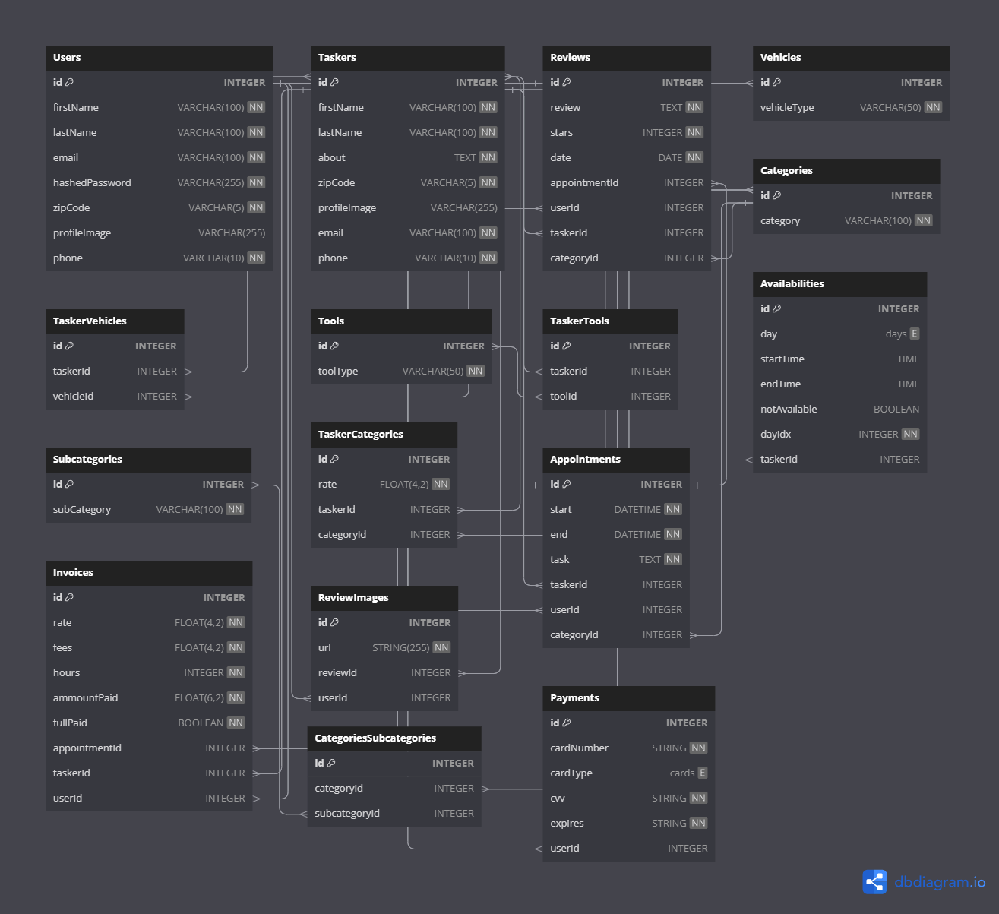

# **Database Schema**

## `Users`

| column name    | data type    | details                               |
|----------------|--------------|---------------------------------------|
| id             | INTEGER      | not null, primary key, auto increment |
| firstName      | VARCHAR(100) | not null                              |
| lastName       | VARCHAR(100) | not null                              |
| email          | VARCHAR(100) | not null, unique                      |
| hashedPassword | VARCHAR(255) | not null                              |
| zipCode        | VARCHAR(5)   | not null                              |
| profileImage   | VARCHAR(255) |                                       |
| phone          | VARCHAR(10)  | not null                              |

## `Taskers`

| column name  | data type    | details                               |
|--------------|--------------|---------------------------------------|
| id           | INTEGER      | not null, primary key, auto increment |
| firstName    | VARCHAR(100) | not null                              |
| lastName     | VARCHAR(100) | not null                              |
| about        | TEXT         | not null                              |
| zipCode      | VARCHAR(5)   | not null                              |
| profileImage | VARCHAR(255) |                                       |
| email        | VARCHAR(100) | not null, unique                      |
| phone        | VARCHAR(10)  | not null                              |

## `Reviews`

| column name   | data type | details                               |
|---------------|-----------|---------------------------------------|
| id            | INTEGER   | not null, primary key, auto increment |
| review        | TEXT      | not null                              |
| stars         | INTEGER   | not null, default: 1                  |
| date          | DATEONLY  | not null                              |
| appointmentId | INTEGER   | references: Appointments.id           |
| userId        | INTEGER   | references: Users.id                  |
| taskerId      | INTEGER   | references: Taskers.id                |
| categoryId    | INTEGER   | references: Categories.id             |

## `Vehicles`

| column name | data type   | details                               |
|-------------|-------------|---------------------------------------|
| id          | INTEGER     | not null, primary key, auto increment |
| vehicleType | VARCHAR(50) | not null                              |

## `TaskerVehicles`

| column name | data type | details                               |
|-------------|-----------|---------------------------------------|
| id          | INTEGER   | not null, primary key, auto increment |
| taskerId    | INTEGER   | references: Taskers.id                |
| vehicleId   | INTEGER   | references: Vehicles.id               |

## `Tools`

| column name | data type   | details                               |
|-------------|-------------|---------------------------------------|
| id          | INTEGER     | not null, primary key, auto increment |
| toolType    | VARCHAR(50) | not null                              |

## `TaskerTools`

| column name | data type | details                               |
|-------------|-----------|---------------------------------------|
| id          | INTEGER   | not null, primary key, auto increment |
| taskerId    | INTEGER   | references: Taskers.id                |
| toolId      | INTEGER   | references: Tools.id                  |

## `Categories`

| column name | data type    | details                               |
|-------------|--------------|---------------------------------------|
| id          | INTEGER      | not null, primary key, auto increment |
| category    | VARCHAR(100) | not null                              |

## `Subcategories`

| column name | data type | details                               |
|-------------|-----------|---------------------------------------|
| id          | INTEGER   | not null, primary key, auto increment |
| subCategory | INTEGER   | not null                              |

## `CategoriesSubcategories`

| column name   | data type | details                               |
|---------------|-----------|---------------------------------------|
| id            | INTEGER   | not null, primary key, auto increment |
| categoryId    | INTEGER   | references: Categories.id             |
| subcategoryId | INTEGER   | references: Subcategories.id          |

## `TaskerCategories`

| column name | data type   | details                               |
|-------------|-------------|---------------------------------------|
| id          | INTEGER     | not null, primary key, auto increment |
| rate        | FLOAT(4, 2) | not null                              |
| taskerId    | INTEGER     | references: Taskers.id                |
| categoryId  | INTEGER     | references: Categories.id             |

## `Appointments`

| column name | data type | details                               |
|-------------|-----------|---------------------------------------|
| id          | INTEGER   | not null, primary key, auto increment |
| start       | DATETIME  | not null                              |
| end         | DATETIME  | not null                              |
| task        | TEXT      | not null                              |
| taskerId    | INTEGER   | references: Taskers.id                |
| userId      | INTEGER   | references: Users.id                  |
| categoryId  | INTEGER   | references: Categories.id             |

## `Availabilities`

| column name  | data type | details                                           |
|--------------|-----------|---------------------------------------------------|
| id           | INTEGER   | not null, primary key, auto increment             |
| day          | ENUM      | ['Mon', 'Tue', 'Wed', 'Thu', 'Fri', 'Sat', 'Sun'] |
| startTime    | TIME      |                                                   |
| endTime      | TIME      |                                                   |
| notAvailable | BOOLEAN   | not null, default: false                          |
| dayIdx       | INTEGER   | not null                                          |
| taskerId     | INTEGER   | references Taskers.id                             |

## `Invoices`

| column name   | data type   | details                               |
|---------------|-------------|---------------------------------------|
| id            | INTEGER     | not null, primary key, auto increment |
| rate          | FLOAT(4, 2) | not null                              |
| fees          | FLOAT(4, 2) | not null                              |
| hours         | INTEGER     | not null                              |
| amountPaid    | FLOAT(6, 2) | not null, default: 0                  |
| fullPaid      | BOOLEAN     | not null, default: false              |
| appointmentId | INTEGER     | references: Appointments.id           |
| taskerId      | INTEGER     | references: Taskers.id                |
| userId        | INTEGER     | references: Users.id                  |

## `ReviewImages`

| column name   | data type    | details                               |
|---------------|--------------|---------------------------------------|
| id            | INTEGER      | not null, primary key, auto increment |
| url           | VARCHAR(255) | not null                              |
| reviewId      | INTEGER      | references: Reviews.id                |
| userId        | INTEGER      | references: Users.id                  |

## `Payments`

| column name | data Type    | details                                                |
|-------------|--------------|--------------------------------------------------------|
| id          | INTEGER      | not null, primary key, auto increment                  |
| cardNumber  | VARCHAR(255) | not null                                               |
| cardType    | ENUM         | ['visa', 'mastercard', 'discover', 'american_express'] |
| cvv         | VARCHAR      | not null                                               |
| expires     | VARCHAR      | not null                                               |
| userId      | INTEGER      | references: Users.id                                   |
